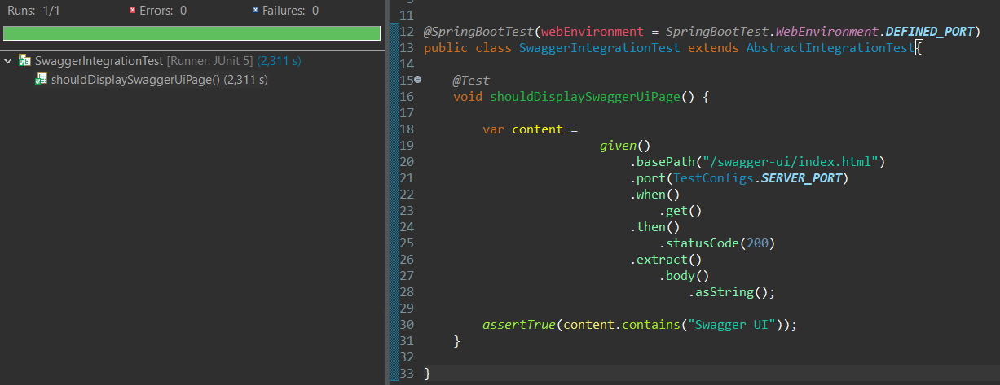

# API RESTful Java

Esse projeto consiste no desenvolvimento de uma **API RESTful** feita em **Spring Boot 3** e **Java 18**.

## Tecnologias Utilizadas

* Java 18
* Spring Boot v3.2.1
* MySQL
* Hibernate
* FlyWay
* RESTful / Hateoas
* Dozzer
* Swagger
* JUnit
* REST Assured
* Testcontainers
* Mokito
* Docker
* JWT / Spring Security

## Projeto Books

Essa API tem como principais funcionalidades a utilização de alguns métodos HTTP, tais como GET, POST, PATCH, PUT e DELETE, que irão manipular um banco de dados, mais precisamente a tabela **books** que contém as seguintes colunas (**id,author,launch_date,price,title,enabled**).

## Autenticação

Para poder ter acesso a todas essas funções, primeiro é necessário realizar a autenticação (Username e Password), onde foi utilizado a dependência do **JWT** para geração e validação do **accessToken** e do **RefreshToken** que são criptografados utilizando o padrão **pbkdf2**.

## Documentação da API

Todos os **Endpoints** disponíveis na API estão documentados com o **Swagger**, onde pode ser acessado através do endereço **/swagger-ui/index.html**.

## Banco de Dados

Foi utilizado o **MySQL** como banco de dados relacional. Para mapeamento do mesmo dentro da aplicação foi utilizado o **Hibernate** e para criação das migrations, usei o **FlyWay**.

## Arquitetura de Camadas (Layered Architecture)

Em resumo a API funciona assim: Após receber uma requisição **HTTP**, será validado o **accessToken**, caso seja inválido ou não exista, retornará um erro do tipo **"403 - Forbiden"**.  

Caso contrário, a solicitação será transformada em **VO** (Value Object) e logo em seguida convertida em entidade através do **Dozzer** antes de ser persistida no banco de dados. Essa arquitetura evita a exposição da estrutura da API para os clients, além de facilitar o seu versionamento.

Logo após o processamento da solicitação, será retornada uma entidade que também será convertida em **VO** (Value Object) utilizando o **Dozzer** antes do resultado ser exibido para o client (nesse processo é utilizado o **Hateoas** para anexar os links no json respose, tornando assim a API **RESTful**).

Exemplo:
```mermaid
graph LR
A((Client)) --> B{API}
B --> C[Controller  = VO]
C --> D[Services = DozzerMapper]
D --> E[Repository = Entity]
E --> F{Database}
F --> E
E --> D
D --> C
C --> B
B --> A
```
## Tests
Foram realizados alguns **testes unitários** com o **JUnit** e o **Mockito** para validar a lógica, além de **testes de integração** utilizando **REST Assured** e **Testcontainers**  simulando dois containers no **Docker**, um com o banco de dados e outro com o Swagger.

Exemplo dos testes unitários **(JUnit + Mockit)**.

Exemplo do teste de integração (**REST Assured** + **Testcontainers**).